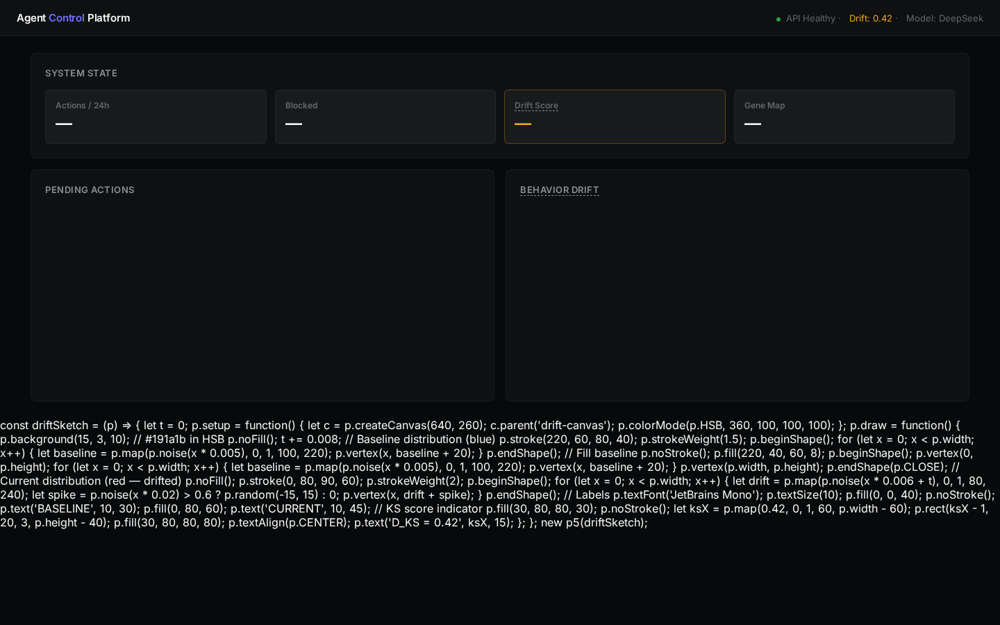

# agent-lint

[](https://github.com/kittykatemybaby/Agent-lint/actions)
[](LICENSE)

`agent-lint` 是一個命令列工具，在 agent 執行動作之前先做檢查。它用規則比對找出有風險的輸入和奇怪的執行路徑——不調 LLM，跑起來很快。

---

## 它能幫你解決什麼

如果你部署過會自己調 SQL、發 HTTP、寄信的 AI agent，你大概遇過這兩種狀況：

1. **沒人發現它闖禍了。** agent 對五萬筆訂單跑了 `UPDATE orders SET status='refunded'`，等你發現的時候已經被客戶罵了。
2. **同樣的錯一直犯。** 每次 session 撞一樣的 bug，每次都從頭來過，燒 token 也浪費時間。

`agent-lint` 做的事很簡單：在它真的動手之前先攔一次，順便把犯過的錯記下來，下次直接跳過。

---

## 怎麼用

### 檢查一個 SQL 操作

```bash
$ agent-lint check "DELETE FROM orders WHERE status = 'pending'" --tool sql --rows 5000
{
  "verdict": "REJECT",
  "risk_score": 0.70,
  "patterns_detected": ["影響範圍 (5000) 超過上限 (1000)"]
}
```

它做的事情：拿這個動作去跟事先定義好的規則比對——這個工具類型能動多少行、能不能回溯、有沒有踩到已知的風險關鍵字。沒用到 LLM。

### 一個正常通過的例子

```bash
$ agent-lint check "SELECT * FROM orders WHERE created > '2026-01-01'" --tool sql --rows 100
{
  "verdict": "APPROVE",
  "risk_score": 0.30,
  "patterns_detected": []
}
```

### 看目前記住了哪些錯誤

```bash
$ agent-lint genes
DeepSeek API timeout      → 重試 (等 3 秒，最多 2 次)
Rate limit 429             → 退避 (等 60 秒)
Database connection refused → 重試 (等 5 秒，最多 2 次)
Permission denied          → 升級給人處理
```

### 拿一個 trace 來檢查

```bash
$ agent-lint audit trace.json
{
  "steps": 12,
  "errors": 1,
  "warnings": 2,
  "findings": [
    {"step": 7, "severity": "error", "description": "POST /refund 超時"},
    {"step": 7, "severity": "warning", "description": "第 7 步花了 6200ms，偏慢"}
  ]
}
```

---

## 附帶一個 Dashboard

```bash
python3 dashboard_server.py
# → http://localhost:8765
```

本地開一個網頁，看系統狀態、待處理的動作、行為漂移的視覺化。不依賴外部服務。



---

## 它做不到的事

說清楚比較好：

- **它不保證絕對安全。** 這個分數是經驗規則算出來的。分數低不代表一定沒事，分數高也不代表一定出事。它就是一個標記工具，不是數學證明。
- **它不是即時攔截。** 它檢查的是你要部署的動作，不是 agent 跑起來之後才攔。那個還在開發中。
- **不該取代人做最終決定。** 高風險的動作還是要讓人看過。
- **它不幫你收 trace。** 你要自己把 trace 檔案拿來給它看，它不會主動去任何地方撈。

---

## 分數是怎麼算的

目前是加權求和，很直白：

| 因素 | 加多少 | 舉例 |
|------|--------|------|
| 工具本身風險 | 0.1–0.4 | SQL 寫入 > 讀取 |
| 影響筆數 | 0–0.3 | 五萬行 > 一百行 |
| 不可回溯 | +0.1 | DELETE 做下去就沒了 |
| 踩到已知風險詞 | +0.15–0.4 | 出現「批量刪除」、「個資」等字眼 |
| 可回溯動作 | 0 | 寫檔案還可以 rollback |

門檻值：
- **0.70 以上** → 拒絕
- **0.40–0.69** → 升級給人看
- **0.40 以下** → 放行

`--rows` 這個參數之所以存在，是因為影響範圍差很多。對 5 行 DELETE 跟對五萬行 DELETE 完全不一樣。

---

## 裡面有什麼

| 檔案 | 做什麼 |
|------|--------|
| `stop_conditions.py` | 定義每一步什麼叫成功、什麼時候該停、什麼時候叫救命 |
| `gene_map.py` | 用 SQLite 記住每次出錯和怎麼修好，下次 1 毫秒命中 |
| `prediction_dataset.py` | 動手前先預測結果，事後回來對答案，追蹤猜得準不準 |
| `cross_audit.py` | 讓另一個模組去讀執行結果，標記訊號品質、卡住的流程、資料缺口 |
| `observation_lifecycle.py` | 好用的模式留下來繼續用，沒用的就歸檔收起來 |

全部零依賴。Python 3.10 往上就能跑。

---

## 安裝

```bash
git clone https://github.com/kittykatemybaby/Agent-lint.git
cd Agent-lint
chmod +x agent-lint
bash demo.sh
```

如果你習慣用 pip：

```bash
pip install git+https://github.com/kittykatemybaby/Agent-lint.git
```

---

## 目前的限制

- 評分靠的是寫死的規則，不會自己進步。不更新規則就不會變聰明。
- 沒有內建事件收集。trace 要你自己拿來。
- Gene Map 一出生只帶 5 個預設模式，要靠你每次記錄修復來養大它。空的 Gene Map 幫不上忙。
- Cross-audit 只讀本機 JSON 檔案，不會去接任何外部平台。
- Dashboard 只能在 localhost 開，沒有登入、沒有多人。

---

## 別人在 CI 裡怎麼用

某個金融科技團隊把 agent-lint 放進 CI pipeline：

```yaml
# .github/workflows/agent-check.yml
- name: 檢查 agent 產出的 SQL
  run: |
    agent-lint check "$(cat agent_output.sql)" --tool sql --rows "$(wc -l < affected.csv)"
    agent-lint audit latest_trace.json
```

萬一 agent 對一萬行生出了 DELETE，CI 會直接把部署擋下來。

---

MIT · [Kitty Kate](https://x.com/KittyKatemybaby)

[English](README.md)
